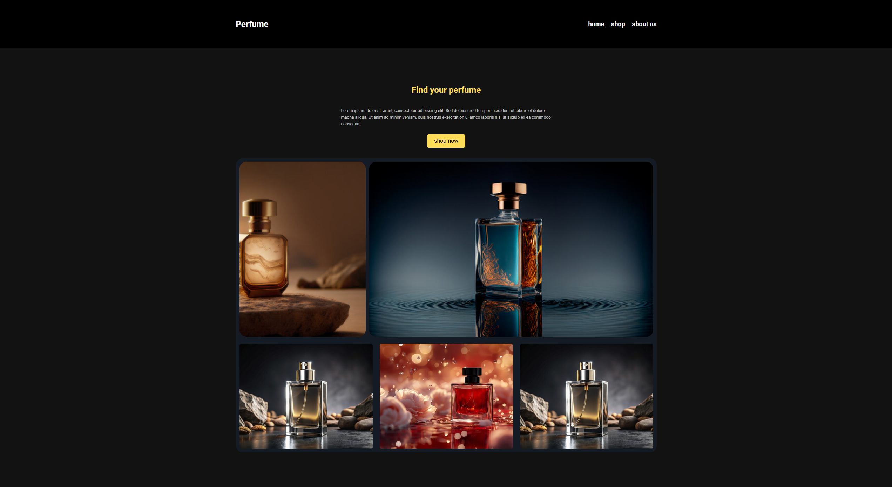
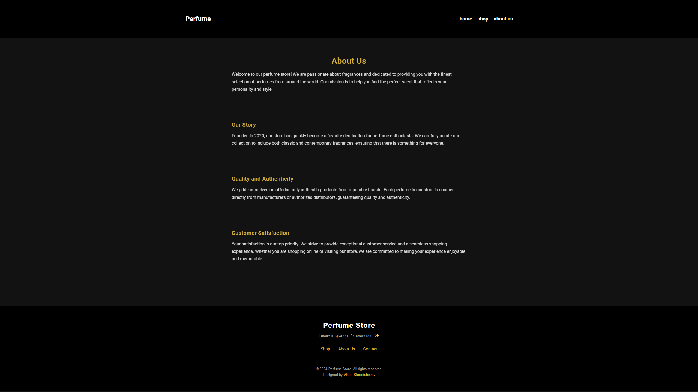

<div align="center">
  
  
  <h1>🌷 Perfumes Shop App</h1>
  <p><strong>Luxury fragrances for every soul ✨</strong></p>
  
  <p>
    
    
    
    
  </p>

  <p align="center">
    <a href="#-overview">Overview</a> •
    <a href="#-features">Features</a> •
    <a href="#-installation">Installation</a> •
    <a href="#-project-structure">Structure</a> •
    <a href="#-screenshots">Screenshots</a> •
    <a href="#-author">Author</a>
  </p>
</div>

---

> 🧠 *“Smell the code — feel the elegance.”*

---

# 💐 Perfumes App

A modern perfume store web application built with **React**, **Redux Toolkit**, and **SCSS** — featuring elegant UI, centralized state management, and a lightweight backend powered by **Node.js + SQL**.

---

## 🌸 Overview

**Perfumes App** is a full-stack e-commerce project for discovering and purchasing perfumes.  
It combines a **React frontend** with an **Express + SQL backend**, maintaining a modular and scalable architecture.

**Highlights:**
- ⚛️ Component-based React design  
- 🧩 Centralized state management  
- 🎨 SCSS modular styling  
- 💾 SQL database integration  
- 🚀 Lightweight backend  

---

## 🧠 Tech Stack

### Frontend
- React (Vite)
- Redux Toolkit  
- React Router DOM  
- SCSS  
- Axios  

### Backend
- Node.js + Express  
- SQL (perfumes.sql schema)  
- dotenv  
- cors  

---

## 🚀 Features

- 🛍️ Browse perfumes with images & details  
- 🔍 Search and filter functionality  
- 🧾 Product detail pages  
- 🛒 Shopping cart (add/remove)  
- 💳 Simulated checkout flow  
- 📱 Responsive design  
- ⚡ Fast API requests with Axios  

---

## 📂 Project Structure

```bash
perfumes_app/
│
├── assets/                        # Screenshots & shared media
├── frontend/                      # 💻 React application
│   ├── public/
│   │   └── index.html
│   └── src/
│       ├── components/            # Header, Footer
│       ├── Pages/                 # Home, Shop, AboutUs, Bin
│       ├── styles/                # SCSS modules
│       ├── toolkit/               # Redux Toolkit store & slices
│       └── App.jsx
│
├── server/                        # ⚙️ Backend (Express)
│   ├── db/
│   │   └── perfumes.sql
│   └── server.js
│
└── README.md
```
---
## 🧩 Installation
## 1️⃣ Clone the repository

```bash
git clone https://github.com/yourusername/perfumes_app.git
cd perfumes_app
```

## 2️⃣ Install dependencies
## Frontend
```bash
cd frontend
npm install
npm start
```
## Backend
```bash
cd server
npm install
node server.js
```
## Frontend → http://localhost:3001
## Backend → http://localhost:5000
---

## 📸 Screenshots

| 🏠 Home | 🛍️ Shop |
|:--:|:--:|
|  |  |

| 🧾 About Us | 🧺 Bin |
|:--:|:--:|
|  |  |

> 🖼️ Screenshots are stored in the `assets/` folder inside the project root.

---
## 🧑‍💻 Author
Developed by Viktor Starodubcev
Frontend Developer passionate about clean UI, structured architecture, and modern React ecosystems.

⭐ If you like this project, give it a star on GitHub!
